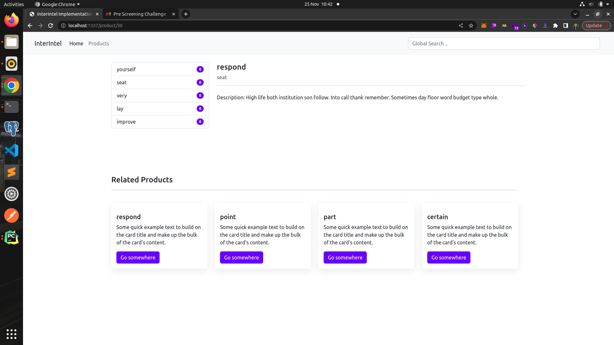

# Implementation Engineer Interview Questions

# SECTION A
> [Question 1](1.md)
> 
> [Question 2](2.md)
> 
> [Question 3](3.md)

# SECTION B
## Question 2

> This project is a small mimic of an ecommerce system where the user is able to view listed products. Each product has product page where the specific details of the product are listed. The user is able to search for a specific item using the search input and view the response in a results page.
> 

## Table of Contents

- [General Info](#general-information)
- [Technologies Used](#technologies-used)
- [Features](#features)
- [Screenshots](#screenshots)
- [Setup](#setup)
- [Usage](#usage)
- [Handling Search Functionality ](#handling-search-functionality-)
- [Acknowledgements](#acknowledgement)
- [Contact](#contact)

## General Information

- The project has a list of products and each product has its own category. The categories column show the number of products in the category. When the user clicks a product, the user is redirected to a page that contains the specific details of the product.
- The purpose of this project is to implement a search functionality where the user is able to search for an item and redirected to a results page.
- The project aims to answer Section B question 2 of the implementation engineer interview question

## Technologies Used

- Django - Version 4.2.7
- Python - Version 3.8-alpine
- PostgresSQL - Version 15-alpine
- Nginx - Version 1.25-alpine

## Features

- Product Listing
- Product Details
- Global Search for Product

## Screenshots





## Setup

To get started first create a **.env** file on the root directory of the project. The template for the env file is provided in the **.env-example** on the root directory
* RUN ```sudo sytemctl stop postgres``` - This stops postgres service
* RUN ```docker-compose build``` - This creates an image for the project
* RUN ```docker-compose up -d```

> This starts the project at:  
> 
>**http://localhost:1337**
## Usage

Access the project at **http://localhost:1337**
To test the search feature try typing on the global search an a dropdown of products with similar name will appear below


## Handling Search Functionality 

### Search
The search feature involves searching through a database for a record containing a certain attribute. This means capturing user inputs and making an API call to the server and returning records with similar attributes.
* #### Challenges
  * Not making too many requests to the server to ensure it does not get overwhelmed
  * Balancing the flexibility query option with simplicity for the user
  * Scalability of the search option

* #### Solution
  * Making too many requests to the server can be solved by implementing the debounce feature. Debounce in simple terms refers to delaying the execution of a function until after a period of inactivity. This delay ensures the server does not receive too many unnecessary calls saving resources.
    * Debounce can be implemented as shown below
      ```javascript
        /**
          * @Param {Function} callback
          * @Param {Number} delay
          * @Return {Function}
          * */
         const Debouncer = (callback, delay) => {
             let timer;
             return (...args) => {
                 let context = this
                 clearTimeout(timer)
    
                 timer = setTimeout(() => {
                     callback.apply(context, args)
                 }, delay)
             }
         }
      ```
      The function above takes in a callback and a delay: The callback is the function that you want to delay its execution - in this case I passed the function that fetches the search results from the server.  
      The debouncer maintains a timer variable which holds the setTimeout instance that is currently in the javascript event loop awaiting execution. This enables the debouncer to remove it from the event loop incase the debouncer is initialized again in this case when a user inserts an input in the search bar.
      The debouncer can be initialized as shown below
      ```javascript
        Debouncer(() => {
            SearchFunction(value)
                .then(r => {
                    setProducts(r)
                })
                .catch(err => {
                    setProducts(err)
                })
        }, 1000)()
      ```
      Because in this case searchFunction returns a promise I initialize it inside an empty function to capture the response which is a promise.
    * How to manage and display search results
        
      The system should be able to display the status and results of the search feature. This means it should display results the first time the user focuses on the search bar and should update the results when user uses the search input.
      Below is the code of how I manage to manage the current state of the search results real time.
      ```javascript
        let state = {
        products: [],
        /**
         * @Param {Array} items
         * */
        setProducts: (items) => {
            state = {
                ...state,
                products: [...items]
            }
            state.renderItems()
        },
        renderItems: () => {
            const { products } = state
            let items = ''
            if(products.length > 0){
                products.forEach(product => {
                    const product_detail_url =  location.protocol + '//' + location.host + '/product/' + product.id
                    items += `
                        <li><a class="dropdown-item" href="${product_detail_url}">
                         <div class="d-flex w-100 justify-content-between">
                              <h5 class="mb-1">${product.name}</h5>
                              <small>3 days ago</small>
                            </div>
                            <p class="mb-1">${product.description}.</p>
                            <small>${product?.category.name}</small>
                        </a></li>
                    `
                })
            }else{
                items += `
                    <li><a class="dropdown-item text-muted" href="#">No results found</a></li>
                `
            }
            $('#search_items').html(items)
        },
        renderSearching: () => {
            let items = `
                    <li><a class="dropdown-item text-muted" href="#">Searching ....</a></li>
                `
             $('#search_items').html(items)
        }
      }
      ```
      I use the variable products to store the results returned by the server. The function setProducts is utilized to update the product variable while render items is used to update the searchbar's dropdown
    

* To solve the issue of balancing the flexibility query option with simplicity for the user I use Django's **Q** object to build a complex query from a user input without the user needing to add other filers as shown below
  ```python
  from django.views.generic import TemplateView
  from django.db.models import Q
  from django.http import JsonResponse
  
  from ecommerce.models import Product
    
  class IndexView(TemplateView):
    model = Product
    def get_context_data(self, **kwargs): 
        q = self.request.GET.get('q')
        query = Q(pk__isnull=False)
        if q:
            query.add(Q(Q(name__icontains=q) | Q(description__icontains=q) | Q(category__name__icontains=q)),
                      Q.AND)
  
        products = (self.model.objects.filter(query)
             .select_related('category')
             .order_by('-id')
         )[:10]
  
        return JsonResponse({
            "results": [{
                "id": product.id,
                "name": product.name,
                "description": product.description,
                "category": {
                    "name": product.category.name
                }
            } for product in products]
        }, safe=False)
  ```
  
  The Q object enables me to create a complex query string giving the ability to search multiple fields in the database with a single query
* To ensure scalability the results from the query are sliced to a maximum of 10 to reduce the amount of data coming as such results. SELECT JOINS are also utilized to ensure we reduce similar and duplicate queries reducing significantly the response time


## Acknowledgement

Give credit here.

- Docker based setup is credited to [this tutorial](https://testdriven.io/blog/dockerizing-django-with-postgres-gunicorn-and-nginx/).

## Contact

Created by [@ray3du](https://www.linkedin.com/in/ray3du/) - feel free to contact me!
